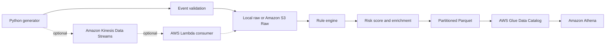

# AWS Streaming Fraud Detection

[Português](./README.md) | English

Educational open source Data Engineering project on AWS for fraud detection with synthetic data. The repository provides a local demo without AWS, a batch processing path with Amazon S3, Parquet, AWS Glue Data Catalog and Amazon Athena, plus an optional streaming processing mode with Amazon Kinesis Data Streams.

## Purpose

This project shows how to model synthetic financial events, validate data contracts, apply explainable risk rules, generate partitioned Parquet files and prepare analytics with Amazon Athena. It is not a production anti-fraud system and does not claim PCI DSS, LGPD or equivalent compliance.

## Local demo

```bash
python -m pip install -r requirements.txt
python -m fraud_detection demo --transactions 1000 --seed 42
```

The demo writes files to `data/local/`, which is ignored by Git, and prints a summary with analyzed transactions, suspicious transactions, JSON files, Parquet files and the main triggered reasons.

## Architecture



## Modes

- **Local:** does not require an AWS account, does not use credentials and generates deterministic data with `--seed`.
- **AWS batch processing:** the producer sends JSON to Amazon S3 Raw, processing generates Parquet in Amazon S3 Processed, AWS Glue Data Catalog catalogs the table and Amazon Athena queries the data.
- **Optional streaming processing:** Amazon Kinesis Data Streams can be enabled by Terraform with `enable_streaming = true`; it is disabled by default because it may create recurring costs.

## Main capabilities

- Typed Python package in `src/fraud_detection`.
- Safe synthetic data without full names or full card numbers.
- Testable rules with identifier, weight, description and evidence.
- Risk score, risk level, triggered reasons and rule version.
- JSON and Parquet writing partitioned by year, month, day and hour.
- Modular Terraform with encrypted Amazon S3 buckets, public access blocking and optional streaming.
- Athena queries in `analytics/queries`.

## AWS quick guide

```bash
cd terraform/environments/dev
cp terraform.tfvars.example terraform.tfvars
# edit unique_suffix before planning
terraform init -backend=false
terraform plan
```

Do not run `terraform apply` before reviewing costs, names and permissions. The project does not configure a remote backend automatically.

## Documentation

- [Architecture](docs/architecture.md)
- [Local demo](docs/local-demo.md)
- [AWS deployment](docs/aws-deployment.md)
- [Batch processing](docs/batch-mode.md)
- [Streaming processing](docs/streaming-mode.md)
- [Fraud rules](docs/fraud-rules.md)
- [Data contract](docs/data-contract.md)
- [Athena analytics](docs/athena-analytics.md)
- [Security](docs/security.md)
- [Costs](docs/cost-estimation.md)
- [Learning path](docs/learning-path.md)

## Contributions

See [CONTRIBUTING.md](CONTRIBUTING.md). There are beginner-friendly ideas for documentation, tests, analytics, Terraform, Python and observability.

## Learning resources

This repository is free and independent. For a structured Portuguese course with additional lessons and projects, see the maintainer's course: [Engenharia de Dados na AWS: do Zero aos Projetos Reais](https://www.udemy.com/course/engenharia-de-dados-na-aws-do-zero-aos-projetos-reais/?referralCode=E28670B9116BA68E08A9).
