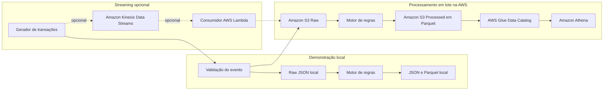
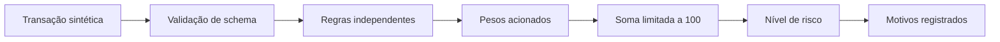

<div align="center">
  <h1>Pipeline de Detecção de Fraudes na AWS</h1>
  <p><strong>Pipeline educacional de Engenharia de Dados que gera transações sintéticas, avalia sinais de risco com regras explicáveis e disponibiliza os resultados para análise com Amazon S3, Parquet, AWS Glue Data Catalog e Amazon Athena.</strong></p>
  <p>Português | <a href="./README.en.md">English</a></p>


<p>
  <a href="https://aws.amazon.com/"></a>
  <a href="https://www.python.org/"></a>
  <a href="https://developer.hashicorp.com/terraform"></a>
</p>

<a href="https://www.udemy.com/course/engenharia-de-dados-na-aws-do-zero-aos-projetos-reais/?referralCode=E28670B9116BA68E08A9">
  
</a>

<p>
  <a href="#visao-geral">Visão geral</a> ·
  <a href="#arquitetura">Arquitetura</a> ·
  <a href="#decisao">Como a decisão funciona</a> ·
  <a href="#demo-local">Demonstração local</a> ·
  <a href="#aws">AWS</a> ·
  <a href="#documentacao">Documentação</a> ·
  <a href="#contribuicao">Contribuição</a>
</p>

</div>

<a id="visao-geral"></a>

## Resumo

Este projeto demonstra como construir um pipeline de dados para avaliar transações financeiras sintéticas e classificá-las por risco. Ele possui uma demonstração local sem AWS, um caminho de processamento em lote com Data Lake em Amazon S3 e um modo de processamento em streaming opcional com Amazon Kinesis Data Streams.

O foco é Engenharia de Dados, reprodutibilidade e explicabilidade. O projeto não usa Machine Learning na implementação atual e não deve ser tratado como sistema antifraude de produção.

## Demonstração rápida

```bash
python -m pip install -r requirements.txt
python -m fraud_detection demo --transactions 1000 --seed 42
```

A demonstração gera dados sintéticos em `data/local/`, grava eventos raw em JSON, produz avaliações processadas em JSON e Parquet particionado, e imprime um resumo com transações analisadas, transações suspeitas, arquivos gerados e principais regras acionadas.

<a id="arquitetura"></a>

## Arquitetura



| Camada | Responsabilidade |
| --- | --- |
| Gerador | Cria transações sintéticas seguras e determinísticas quando uma seed é informada. |
| Validação | Confirma que o evento possui os campos esperados antes do processamento. |
| Motor de regras | Avalia sinais objetivos da transação e retorna evidências. |
| Scoring | Soma os pesos das regras acionadas, limita a pontuação a 100 e classifica o risco. |
| Persistência | Grava raw JSON, avaliações processadas e Parquet particionado por ano, mês, dia e hora. |
| AWS Glue Data Catalog | Cataloga os dados processados para consulta analítica. |
| Amazon Athena | Permite consultas SQL sobre os dados catalogados no modo AWS. |

<a id="decisao"></a>

## Como o projeto decide se uma transação é suspeita?

Neste projeto, nenhuma pessoa analisa manualmente cada evento e nenhum modelo de Machine Learning toma a decisão. A classificação é feita por um motor de regras explicável.

O processo acontece em etapas:

1. A transação sintética é recebida pelo pipeline.
2. O schema do evento é validado.
3. As regras são avaliadas individualmente.
4. Cada regra acionada retorna evidências e um peso.
5. O módulo de scoring soma os pesos das regras acionadas.
6. O score é limitado a 100 e convertido em nível de risco.
7. O resultado é persistido com score, nível e motivos da decisão.



Cada regra verifica um sinal da transação. Quando uma regra é acionada, ela adiciona um peso à pontuação de risco e registra uma evidência. A soma desses pesos define o `risk_score`; os limiares configurados definem o `risk_level`; e o campo `triggered_rules` explica quais sinais levaram à classificação.

Um alerta neste repositório significa “transação suspeita para fins educacionais”. Ele não representa confirmação jurídica, bancária ou operacional de fraude.

> Este projeto utiliza regras determinísticas e explicáveis. Ele não utiliza Machine Learning para classificar as transações.

## Regras avaliadas

As regras reais implementadas em `src/fraud_detection/domain/rules.py` são:

| Regra | O que observa | Quando é acionada | Peso | Evidência produzida |
| --- | --- | --- | ---: | --- |
| `high_amount` | Valor da transação | `amount` maior que `FRAUD_HIGH_AMOUNT_THRESHOLD`, padrão `4500`. | 35 | `threshold` usado na avaliação. |
| `profile_amount_mismatch` | Compatibilidade com perfil sintético | `amount` maior que `customer_profile_amount * FRAUD_PROFILE_AMOUNT_MULTIPLIER`, padrão `4`. | 25 | `profile_limit` calculado. |
| `risky_location` | UF da transação | `state` presente em `FRAUD_RISKY_STATES`, padrão `AC,RR,RO`. | 20 | UF da transação. |
| `burst_transactions` | Frequência recente do cliente sintético | Pelo menos `FRAUD_BURST_MIN_TRANSACTIONS`, padrão `3`, dentro de `FRAUD_BURST_WINDOW_SECONDS`, padrão `120`. | 30 | Janela em segundos e quantidade na janela. |
| `device_change` | Dispositivo usado | `device_type` diferente de `customer_usual_device_type`. | 15 | Dispositivo observado e dispositivo usual. |
| `unusual_hour` | Hora do evento | Hora presente em `FRAUD_UNUSUAL_HOURS`, padrão `0,1,2,3,4,5`. | 10 | Hora acionada. |
| `combined_risk_signals` | Combinação de valor, UF e perfil | Valor acima de 75% do limite de alto valor, UF de risco e UF diferente da UF usual do cliente. | 20 | UF da transação e UF usual. |

Todas as regras são configuráveis por variáveis de ambiente e não dependem diretamente de `boto3`.

## Cálculo da pontuação

O módulo `src/fraud_detection/domain/scoring.py` combina as evidências assim:

```text
risk_score = min(100, soma dos pesos das regras acionadas)
```

Classificação padrão:

| Faixa de pontuação | `risk_level` | Interpretação |
| ---: | --- | --- |
| 0 a 34 | `low` | Transação sem sinais suficientes para alerta. |
| 35 a 69 | `medium` | Transação suspeita; merece análise. |
| 70 a 100 | `high` | Transação com múltiplos ou fortes sinais de risco. |

No código, uma avaliação é considerada suspeita quando `risk_level` é `medium` ou `high`.

Na prática:

- duas transações com valor semelhante podem receber scores diferentes se acionarem regras diferentes;
- uma única regra de peso alto pode elevar o risco;
- vários sinais moderados podem se acumular;
- o resultado guarda as regras acionadas em `triggered_rules`;
- a decisão pode ser auditada por meio de `rule_evidence` e `rules_version`.

## Exemplo completo de decisão

Exemplo ilustrativo baseado nas regras atuais:

```json
{
  "transaction_id": "tx_exemplo_001",
  "amount": 7000.0,
  "state": "AC",
  "device_type": "desktop",
  "customer_profile_amount": 100.0,
  "customer_home_state": "SP",
  "customer_usual_device_type": "mobile",
  "masked_card": "card_****_abc123",
  "event_timestamp": "2026-01-01T02:00:00+00:00"
}
```

Avaliação esperada:

| Verificação | Resultado | Peso adicionado |
| --- | --- | ---: |
| Valor acima de `4500` | Acionada | 35 |
| Valor acima de `100 * 4` | Acionada | 25 |
| UF `AC` na lista de risco | Acionada | 20 |
| Dispositivo diferente do usual | Acionada | 15 |
| Horário `02h` em janela incomum | Acionada | 10 |
| Combinação de valor, UF de risco e mudança de UF | Acionada | 20 |
| Múltiplas transações em janela curta | Não acionada neste exemplo | 0 |

Soma dos pesos: `125`. Como o score é limitado a 100, o resultado final é:

```json
{
  "transaction_id": "tx_exemplo_001",
  "risk_score": 100,
  "risk_level": "high",
  "triggered_rules": [
    "high_amount",
    "profile_amount_mismatch",
    "risky_location",
    "device_change",
    "unusual_hour",
    "combined_risk_signals"
  ],
  "rules_version": "2026-07"
}
```

A decisão é explicável porque cada ponto do score aponta para uma regra e uma evidência.

Em uma solução antifraude real, a decisão poderia combinar regras de negócio, modelos estatísticos, Machine Learning, histórico comportamental, validações de risco e revisão humana. Neste repositório, a decisão cabe ao motor de regras implementado no pipeline, de acordo com critérios definidos pelo desenvolvedor.

## Estrutura dos dados

Evento raw:

| Campo | Descrição |
| --- | --- |
| `transaction_id` | Identificador idempotente da transação. |
| `event_timestamp` | Timestamp do evento com timezone, normalizado para UTC na serialização. |
| `amount` | Valor sintético da transação. |
| `state` | UF da transação. |
| `device_type` | Tipo de dispositivo: `mobile`, `desktop` ou `pos`. |
| `customer_id` | Identificador sintético do cliente. |
| `customer_profile_amount` | Valor médio sintético do perfil. |
| `customer_home_state` | UF usual do cliente sintético. |
| `customer_usual_device_type` | Dispositivo usual do cliente sintético. |
| `masked_card` | Token mascarado; não armazena número completo de cartão. |
| `merchant_category` | Categoria sintética do estabelecimento. |

Avaliação processada:

| Campo | Descrição |
| --- | --- |
| `processed_at` | Timestamp de processamento. |
| `risk_score` | Pontuação de risco entre 0 e 100. |
| `risk_level` | Classificação `low`, `medium` ou `high`. |
| `triggered_rules` | Lista de regras acionadas. |
| `rule_evidence` | Evidências detalhadas de cada regra acionada. |
| `rules_version` | Versão das regras aplicadas, padrão `2026-07`. |

## Modos de execução

| Modo | Quando usar | AWS necessária? |
| --- | --- | --- |
| Demonstração local | Estudo, portfólio e validação sem credenciais. | Não |
| Processamento em lote na AWS | Data Lake com Amazon S3, Parquet, AWS Glue Data Catalog e Amazon Athena. | Sim |
| Processamento em streaming opcional | Ingestão contínua com Amazon Kinesis Data Streams. | Sim |

O modo local é o caminho recomendado para começar. O streaming existe como opção arquitetural e fica desligado por padrão para evitar custo recorrente.

<a id="demo-local"></a>

## Guia rápido local

Pré-requisitos:

- Python 3.11 ou superior.
- `pip`.

Execute:

```bash
python -m pip install -r requirements.txt
python -m fraud_detection demo --transactions 1000 --seed 42
```

Saídas esperadas:

- `data/local/raw/transactions/`: eventos raw em JSON.
- `data/local/processed/json/`: avaliações processadas em JSON.
- `data/local/processed/parquet/`: avaliações em Parquet particionado.
- resumo final no terminal.

O parâmetro `--seed` torna a geração reproduzível: a mesma seed produz uma massa sintética equivalente para estudo, testes e comparação de resultados.

Limpeza local:

```bash
make clean-local
```

Em ambientes sem `make`, execute diretamente:

```bash
python scripts/clean_local.py
```

<a id="aws"></a>

## Execução na AWS

Pré-requisitos:

- AWS CLI configurado com credenciais válidas.
- Terraform 1.6 ou superior.
- Permissões para criar os recursos descritos no plano.

```bash
cd terraform/environments/dev
cp terraform.tfvars.example terraform.tfvars
# edite unique_suffix antes de planejar
terraform init -backend=false
terraform plan
```

Não execute `terraform apply` sem revisar custos, nomes de recursos e permissões. O projeto não configura backend remoto automaticamente.

## Consultas e resultados

As consultas do Amazon Athena ficam em `analytics/queries/` e assumem a tabela `fraud_assessments`.

Exemplos de perguntas respondidas:

- Quantas transações foram processadas por hora?
- Quais regras mais acionaram alertas?
- Quais UFs concentram mais transações suspeitas?
- Qual é a distribuição por faixa de `risk_score`?
- Qual é a taxa estimada de transações suspeitas?

## Segurança e custos

- Os dados são sintéticos e não incluem nomes completos nem números completos de cartão.
- `masked_card` usa token mascarado, não um cartão real.
- Buckets S3 são definidos por Terraform, sem nomes pessoais hardcoded no pacote Python.
- Streaming fica desabilitado por padrão.
- `force_destroy` não deve ser usado como padrão seguro em ambientes persistentes.
- Amazon S3, Amazon Athena, AWS Glue Data Catalog, Amazon CloudWatch e Amazon Kinesis Data Streams podem gerar custos.

Este projeto é educacional e não deve ser utilizado como sistema antifraude de produção sem revisão técnica, jurídica, de segurança e de compliance.

## Estrutura do repositório

```text
.
├── src/fraud_detection/   # Pipeline, CLI, regras e persistência
├── tests/                 # Testes automatizados
├── terraform/             # Infraestrutura AWS
├── analytics/             # Consultas do Amazon Athena
└── docs/                  # Documentação complementar
```

<a id="documentacao"></a>

## Documentação complementar

| Documento | Conteúdo |
| --- | --- |
| [Arquitetura](docs/architecture.md) | Visão dos fluxos local, em lote e streaming opcional. |
| [Demonstração local](docs/local-demo.md) | Como rodar sem AWS e onde os arquivos são gerados. |
| [Deploy na AWS](docs/aws-deployment.md) | Orientações para inicializar e revisar a infraestrutura. |
| [Processamento em lote](docs/batch-mode.md) | Caminho batch com S3, Parquet, Glue e Athena. |
| [Processamento em streaming](docs/streaming-mode.md) | Uso opcional do Amazon Kinesis Data Streams. |
| [Regras de fraude](docs/fraud-rules.md) | Lista das regras explicáveis e limitações. |
| [Contrato de dados](docs/data-contract.md) | Campos raw e processed. |
| [Análises com Athena](docs/athena-analytics.md) | Consultas e premissas para analytics. |
| [Segurança](docs/security.md) | Cuidados com dados sintéticos, credenciais e uso educacional. |
| [Estimativa de custos](docs/cost-estimation.md) | Fontes potenciais de custo na AWS. |
| [Trilha de aprendizado](docs/learning-path.md) | Sequência de estudo baseada no repositório. |

## Limitações

- A implementação atual é baseada em regras, não em Machine Learning.
- Regras estáticas podem gerar falsos positivos e falsos negativos.
- Um `risk_level` alto indica suspeita educacional, não confirmação de fraude.
- O conjunto de estados de risco, horários incomuns e limiares é configurável e simplificado.
- Um modelo de ML poderia ser incorporado futuramente como uma etapa adicional de scoring, mantendo as regras como camada explicável.

<a id="contribuicao"></a>

## Contribuição

Contribuições são bem-vindas em documentação, testes, análises, Terraform, Python e observabilidade. Antes de abrir um Pull Request, rode os comandos de qualidade disponíveis no seu ambiente e consulte [CONTRIBUTING.md](CONTRIBUTING.md).

## Continue aprendendo

Este repositório é gratuito e o curso não é requisito para usar o projeto. Para uma trilha estruturada com aulas e projetos adicionais, consulte o curso do mantenedor: [Engenharia de Dados na AWS: do Zero aos Projetos Reais](https://www.udemy.com/course/engenharia-de-dados-na-aws-do-zero-aos-projetos-reais/?referralCode=E28670B9116BA68E08A9).

## Apoie o projeto

Se este projeto ajudou seus estudos, portfólio ou revisão técnica, considere deixar uma estrela no GitHub e compartilhar com outras pessoas interessadas em Engenharia de Dados na AWS.
