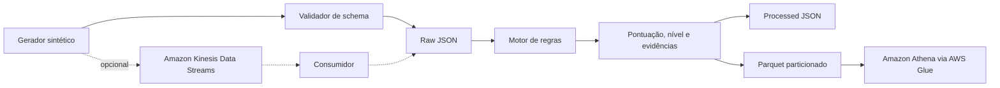

# Arquitetura

O projeto possui dois modos: local e AWS. O modo local é o caminho recomendado para estudo inicial porque não exige credenciais nem cria recursos.

As regras são educacionais e explicáveis. Elas não substituem modelos antifraude reais.
